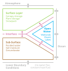

.. currentmodule:: cm4twc
.. default-role:: obj

.. include:: ../../README.rst

.. _fig_diagram:

   Fig. 1: Diagram of the Modelling Framework Blueprint for `cm4twc`.

.. add guides to sidebar

Documentation
-------------

The documentation features three guides for various target audiences:

.. toctree::
   :maxdepth: 2

   users

.. toctree::
   :maxdepth: 2

   contributors

.. toctree::
   :maxdepth: 2

   developers

The documentation lists the modelling components currently available
in the framework:

.. toctree::
   :maxdepth: 2

   science_repository

The Application Programming Interface (API) for the framework is also
documented:

.. toctree::
   :maxdepth: 2

   api_reference
   support

.. add additional sections to sidebar

.. toctree::
   :hidden:
   :maxdepth: 1

   genindex
   licence

Acknowledgements
----------------

The development of this framework is funded by the NERC Hydro-JULES
programme (NE/S017380/1).
